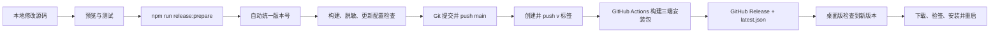

# DeskPet：GitHub 发布与应用更新流程

这套流程用于把本地修改变成 GitHub 新版本，并让已安装的桌面版检查到更新。每个版本只需要换一个新版本号，不需要手工找出并重新打包所有文件。

## 整体流程



## 第一次发布前

1. GitHub 仓库保持为 Public，或另外提供公开的 Release 下载地址。
2. 在 GitHub 仓库的 `Settings → Secrets and variables → Actions` 中添加 `TAURI_SIGNING_PRIVATE_KEY`。
3. 私钥只保存在本机安全位置和 GitHub Secret，不能提交到仓库。
4. 现有安装版必须使用和 `src-tauri/tauri.conf.json` 里公钥配对的私钥签名，否则无法自动升级。

## 每次发布新版本

假设下一版是 `0.2.0`。

### 1. 先在本地确认功能

```bash
cd "/Users/dingwenjing/Documents/ChatGPT/Gintama桌宠"
npm run tauri dev
```

检查新功能后关闭测试版。

### 2. 一键准备版本

```bash
npm run release:prepare -- 0.2.0
```

这个命令会：

- 统一修改 `package.json`、`package-lock.json`、`tauri.conf.json`、`Cargo.toml` 和 `Cargo.lock` 的版本号。
- 检查 GitHub 更新地址和 Tauri 公钥。
- 扫描 Git 已跟踪及尚未跟踪、但可能被上传的文件，检查常见 API Key 和私钥特征。
- 执行 TypeScript 检查和前端生产构建。

如果任意一项失败，不要继续发布，先修复终端显示的问题。

### 3. 检查将要上传的文件

```bash
git status
git diff
```

确认没有 `.env`、API Key、Tauri 私钥、个人导出话本或无关大文件。

### 4. 上传源码

```bash
git add .
git commit -m "release: v0.2.0"
git push origin main
```

GitHub 会先运行 `Check` 工作流，重新执行版本、脱敏和构建检查。

### 5. 发布桌面版

```bash
git tag v0.2.0
git push origin v0.2.0
```

`v0.2.0` 必须和程序版本完全相同。标签推送后，`Release desktop app` 会自动构建 macOS、Windows 和 Linux 安装包，并创建 GitHub Release。

### 6. 确认发布成功

1. 打开 GitHub 仓库的 `Actions`，确认三个系统的任务全部变绿。
2. 打开 `Releases`，确认新版本不是 Draft，且包含 `latest.json` 和对应平台安装包。
3. macOS 手动安装时下载 `.dmg`；已安装的桌面版由更新器读取 `latest.json`，无需用户手动选择更新压缩包。

## 用户端怎样收到更新

- 应用启动后会静默检查一次。
- 也可在 `话本 → 应用更新` 中手动点击“检查更新”。
- 发现新版后点击“立即更新”，程序会下载、验证签名、安装并重新启动。
- 只把源码推送到 `main` 不会让用户自动升级；必须另外推送新的 `v版本号` 标签并成功生成 Release。

## 常用检查命令

```bash
npm run version:check
npm run security:check
npm run build
npm run release:check
```

## 发布出错时

- 不要重复使用已经公开的版本号和标签。
- 修复后发布更高的补丁版本，例如从 `0.2.0` 升到 `0.2.1`。
- 如果只是 GitHub Actions 暂时失败而代码无误，可以在 Actions 页面选择 `Re-run jobs`。
